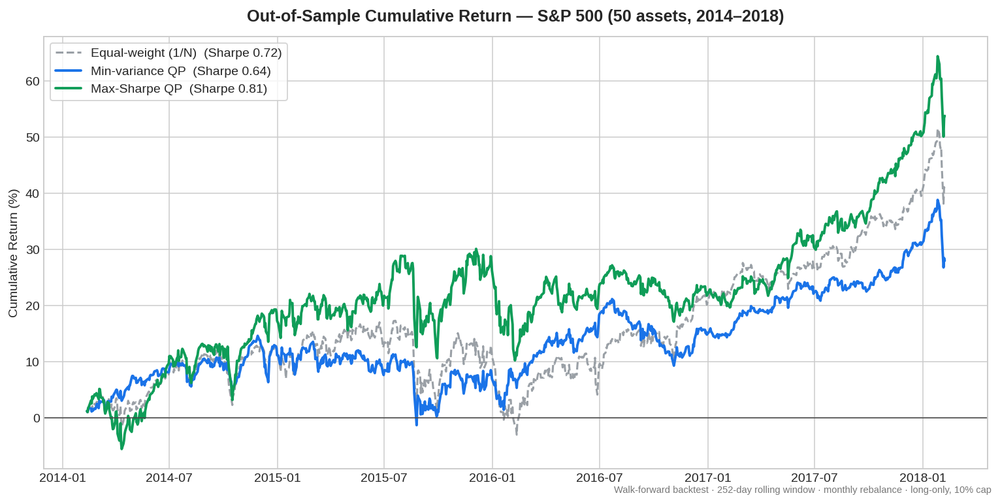

# Data-Driven Portfolio Optimization

Walk-forward, out-of-sample backtest of constrained mean-variance portfolios on real
S&P 500 daily prices, benchmarked against an equal-weight (1/N) baseline.



## Results

| Strategy | Ann. Return | Ann. Vol | Sharpe | Max Drawdown |
|---|---|---|---|---|
| Equal-weight (1/N) — baseline | 9.43% | 13.15% | 0.717 | -17.31% |
| Min-variance QP | 6.73% | 10.48% | 0.642 | -13.88% |
| **Max-Sharpe QP** | 11.85% | 14.59% | **0.812** | -15.27% |

- **Max-Sharpe** improved risk-adjusted return (Sharpe) by **13%** over the 1/N baseline.
- **Min-variance** cut volatility by **20%** and reduced max drawdown by ~3.4pp - a pure
  risk-control profile that trades return for stability.

## What it does

At every monthly rebalance, the optimizer estimates a rolling covariance matrix from the
trailing year of returns and solves a constrained quadratic program to choose portfolio
weights. Those weights are applied to the *next* month's returns - so every number reported
is genuinely out-of-sample, with no look-ahead.

## Data

- Source: S&P 500 daily OHLCV, Feb 2013 - Feb 2018 (`plotly/datasets`, fetched at runtime)
- Universe: 50 most-liquid names (by median dollar volume) with complete history
- 1,259 trading days x 50 assets = 62,950 price points

## Method

| Component | Choice |
|---|---|
| Returns | daily log returns |
| Estimation window | 252 trading days (rolling) |
| Rebalance | every 21 trading days (~monthly), 48 rebalances |
| Constraints | long-only, weights sum to 1, 10% per-name cap |
| Solver | SLSQP (`scipy.optimize`) |
| Strategies | min-variance QP, max-Sharpe QP, equal-weight baseline |
| Evaluation | 1,006 out-of-sample trading days |

**Why these choices.** Min-variance never uses estimated expected returns - only the
covariance - which makes it robust to the noise that makes return forecasts unreliable.
The 10% position cap forces diversification and stops the optimizer concentrating in a few
names. The walk-forward design (estimate on the past, test on the future) is what keeps the
backtest free of look-ahead bias.

## Key finding: the edge is regime-dependent

Splitting the out-of-sample window in half shows *where* the optimizer earns its keep:

| | 1st half (choppy) | 2nd half (bull run) |
|---|---|---|
| Equal-weight Sharpe | 0.02 | 1.72 |
| Min-variance Sharpe | 0.33 | 1.12 |
| Max-Sharpe Sharpe | 0.38 | 1.58 |

Both optimizers decisively beat 1/N in the harder first half, then lose to it during the
2016-18 bull market - because when everything rises, naive full exposure wins and risk
control becomes a drag. The optimizer is most valuable precisely when markets are difficult.

## Caveats

- Results come from a **single historical period**; a backtest is not a forecast.
- Max-Sharpe relies on noisy expected-return estimates and is less robust than min-variance.
- No transaction costs, slippage, or shorting are modelled.

## Run

```bash
pip install -r requirements.txt
python portfolio_optimizer.py   # prints the results table
python make_plot.py             # regenerates performance.png
```

Deterministic - reproduces the table and chart above on every run.
